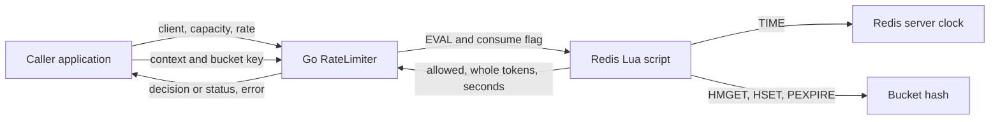

# Architecture

## Overview

A caller embeds a small Go adapter around one Redis Lua program. Configuration lives on the Go `RateLimiter`, while every mutable bucket lives in a Redis hash addressed by the caller's exact key ([implementation](../../lib.go#L10)).

## Components

| Component | Responsibility | Lives in | Talks to |
| --- | --- | --- | --- |
| Go API | Store policy, validate operations, translate script results/errors | [Root package](../../) · [inventory](03-structure.md#root-package) | Caller and Redis client |
| Embedded Lua | Atomic refill, consumption, configuration check and expiry | [Root package](../../) · [script](../../lib.go#L19) | Redis clock and hash |
| Test harness | Create isolated Redis emulator and controlled server clock | [Root package](../../) · [tests](../../lib_test.go#L13) | Go API and miniredis |

## Boundaries and contracts

- `NewRateLimiter(*redis.Client, int, int)` only stores its arguments. Operations validate a non-nil receiver/client, capacity and rate in `1..1e9`, and a nonempty key ([validation](../../lib.go#L38)). The application owns client creation and lifetime ([README](../../README.md#L14)).
- `Allow` consumes at most one token and returns `(false, nil)` when empty. Redis or validation failure returns `(false, error)` ([API](../../lib.go#L54)). Applications must distinguish denial from failure.
- `GetStatus` also executes the script, but with consumption disabled. It returns floored token count and a Unix-seconds timestamp after refill ([API](../../lib.go#L62)). It is a state-changing operation.
- A live key records its capacity/rate. A different policy for that same key fails before writing state ([check](../../lib.go#L25)). Keys have no automatic prefix or tenant separation ([EVAL](../../lib.go#L45)).

## Data model

There is one independent hash per key, so an entity relationship diagram would add no relationship information.

| State | Location | Fields | Defined at |
| --- | --- | --- | --- |
| Limiter policy | Go object | Redis client pointer, integer capacity, integer refill rate | [lib.go:10](../../lib.go#L10) |
| Bucket | Redis hash | `tokens` retains fractional credit, `last_refill_us` records microseconds, `capacity` and `rate` protect policy consistency | [lib.go:23](../../lib.go#L23) |
| Script reply | Transient integer tuple | Allowed flag, floored tokens, floored Unix seconds | [lib.go:35](../../lib.go#L35) |

## State and persistence

Every successful script invocation rewrites the hash and resets its TTL to `ceil(capacity / rate * 1000) + 1000` milliseconds ([writes](../../lib.go#L33)). An absent bucket starts full. Expiry therefore occurs after enough inactivity to refill naturally, but repeated denied requests or status reads also keep the key alive. Persistence and recovery depend entirely on the caller's Redis deployment; the repository promises no quota preservation through Redis state loss ([limits](../../README.md#L14)).

## Deployment, failure and scale

No service, container or deployment manifest exists in the [inventory](03-structure.md). The topology is caller processes sharing an authoritative Redis instance; the API specifically takes `*redis.Client`, not a cluster client ([type](../../lib.go#L11)). Concurrent callers share atomic admission through one script per operation, with no Go-side bucket cache or background worker. Each operation costs a Redis round trip and script execution, so Redis availability and throughput govern operation availability and scale ([EVAL](../../lib.go#L45)).

Redis errors are wrapped and propagated, with no library-level fallback or recovery path ([error handling](../../lib.go#L46)). A network failure after execution can leave the caller uncertain whether a token was consumed; the script has no request identifier or deduplication state. Client transport options and any client retry behavior are supplied externally.
