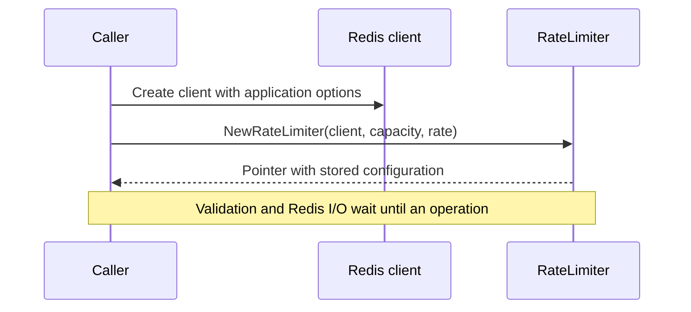
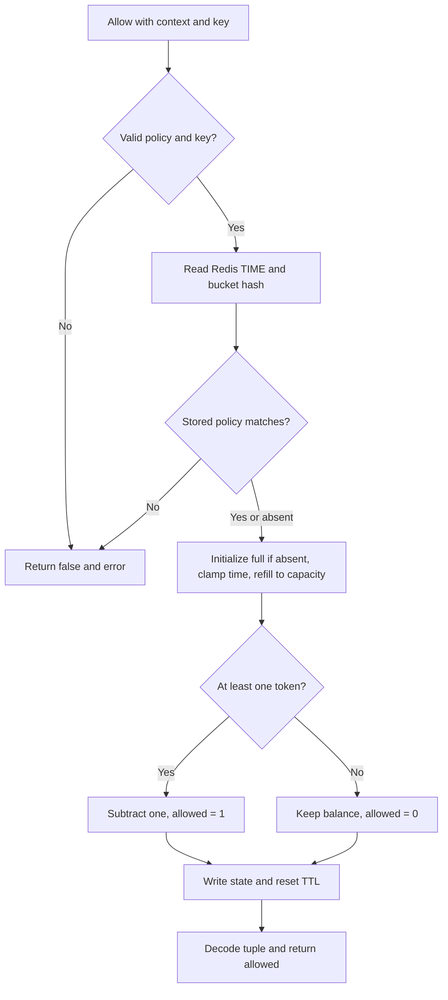
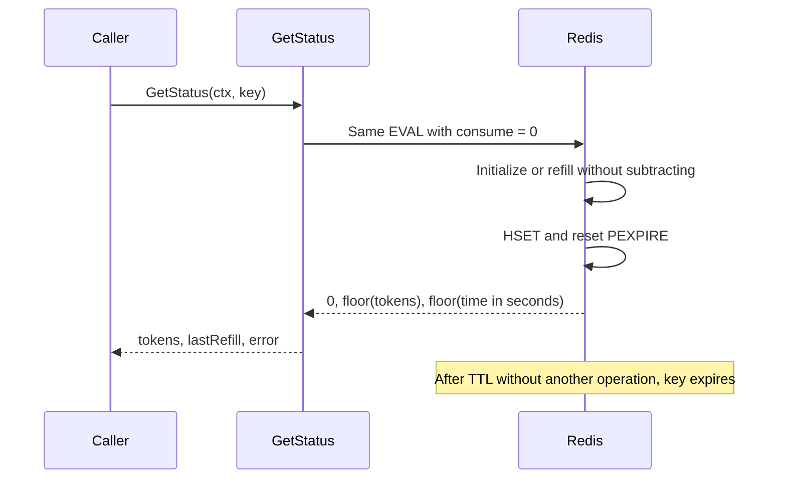
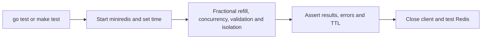

# Flow

## Startup

1. The embedding application supplies the client and context as shown in [README.md:4](../../README.md#L4) · [root package](03-structure.md#root-package).
2. The constructor stores the client and policy without connecting, validating or launching goroutines: [lib.go:15](../../lib.go#L15) · [root package](03-structure.md#root-package).

## Allow

1. `Allow` calls `eval` with `consume=1`: [lib.go:54](../../lib.go#L54) · [root package](03-structure.md#root-package).
2. `eval` rejects invalid policy/client or empty key locally, then sends `EVAL` with one key and three arguments: [lib.go:38](../../lib.go#L38) · [root package](03-structure.md#root-package).
3. Redis obtains microsecond server time and reads the hash. A stored capacity/rate conflict returns a Redis error: [lib.go:20](../../lib.go#L20) · [root package](03-structure.md#root-package).
4. Missing token/timestamp state initializes a full bucket. Time is clamped to the previous timestamp to avoid negative elapsed time, then fractional refill is capped at capacity: [lib.go:28](../../lib.go#L28) · [root package](03-structure.md#root-package).
5. With at least one token, subtract exactly one and set the allowed flag. Otherwise leave the balance unchanged by consumption: [lib.go:31](../../lib.go#L31) · [root package](03-structure.md#root-package).
6. Write the new balance, timestamp and policy, renew TTL, and return an integer tuple: [lib.go:33](../../lib.go#L33) · [root package](03-structure.md#root-package).
7. The adapter decodes three integers, wraps Redis errors, rejects unexpected tuple length and exposes only the decision: [lib.go:45](../../lib.go#L45) and [lib.go:59](../../lib.go#L59) · [root package](03-structure.md#root-package).

All Redis-side steps run inside one script. Validation and Redis failures return an error, whereas ordinary exhaustion returns `false` without an error.

## Status and idle expiry

1. `GetStatus` invokes the same validated path with `consume=0`: [lib.go:63](../../lib.go#L63) · [root package](03-structure.md#root-package).
2. The script skips subtraction but still creates/refills state and resets expiry: [lib.go:28](../../lib.go#L28) · [root package](03-structure.md#root-package).
3. The API returns tuple elements for whole tokens and Unix seconds: [lib.go:68](../../lib.go#L68) · [root package](03-structure.md#root-package).
4. Redis owns expiration after the configured TTL. A later call finds missing state and starts full: [lib.go:34](../../lib.go#L34) and [lib.go:28](../../lib.go#L28) · [root package](03-structure.md#root-package). There is no refill ticker or cleanup goroutine.

## Verification

1. `make test` runs verbose package tests: [Makefile:3](../../Makefile#L3) · [root package](03-structure.md#root-package).
2. Each test starts miniredis, sets a fixed clock, constructs a client and registers cleanup: [lib_test.go:13](../../lib_test.go#L13) · [root package](03-structure.md#root-package).
3. Fractional-refill checks advance server time in 100 ms increments, while capacity checks submit 100 simultaneous requests against capacity 10: [lib_test.go:21](../../lib_test.go#L21) and [lib_test.go:41](../../lib_test.go#L41) · [root package](03-structure.md#root-package).
4. Validation/isolation checks include conflicting policies, positive TTL and a canceled context: [lib_test.go:64](../../lib_test.go#L64) · [root package](03-structure.md#root-package). The suite does not run against a production Redis server ([delivery limitation](../../README.md#L16)).
